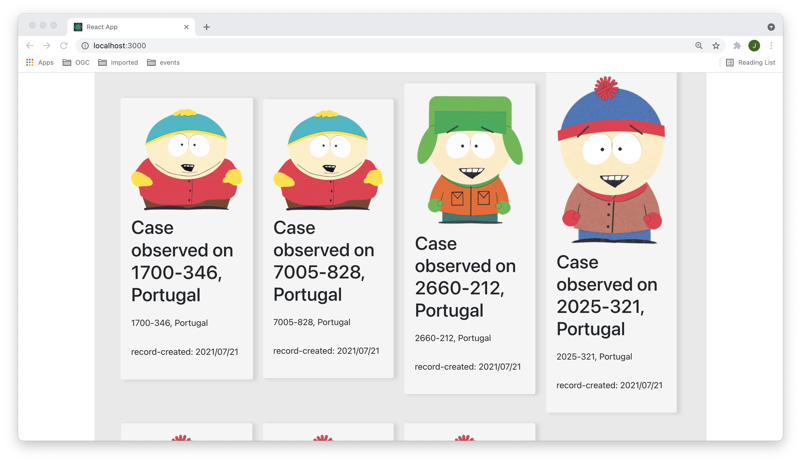

# Record Viewer

This is a simple UI for consuming metadata from OGC API records.



The frontend shows the metadata records as potfolio cards. If you can click in one card, the details will be shown on top, and the location will be shown on a map. You can also filter the records by keyword ("q" parameter).

Publish to GitHub pages with:

```
npm run deploy
```